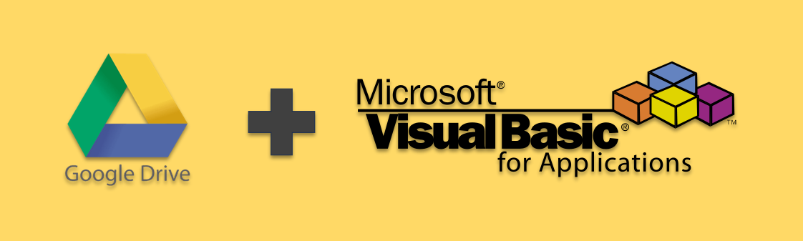

# Api GoogleSheets for VBA




Carga, descarga, lista, mueve, crea, copia, elimina recursos de tu Google Drive usando la [Google Drive API](https://console.cloud.google.com/marketplace/product/google/drive.googleapis.com?q=search&referrer=search&project=total-messenger-353018) con VBA.

Para este proyecto se ha usado la **versión 3 de Google Drive**.

## Hay mucho por desarrollar

Eh tratado de cubrir las operaciones básicas, sin embargo aún queda mucho por cubrir, si quieres colaborar con el desarrollo de este repositorio haz un fork y sube una PR para discutirlo.

> [!NOTE]
> La función de carga de recursos cubren **carga simple**, **carga multiparte** recomendada para la carga `<= 5mb` revisa para mas detalles [subir datos de archivos](https://developers.google.com/drive/api/guides/manage-uploads?hl=es-419). Cargas mayores no estan soportadas por ahora.

## Tabla de contenido

1. [Instalación](#instalación)
2. [Activar referencias](#activar-referencias)
3. [Configuración de entorno en Google](#configuración-de-entorno-en-google)
4. [Guardar credenciales de acceso](#guardar-credenciales-de-acceso)
5. [Probar FlowOauth y generar el token de acceso](#probar-flowoauth-y-generar-el-token-de-acceso)
6. [Ejemplo de uso](#ejemplo-de-uso)
7. [Recursos adicionales](#Recursos-adicionales)

## Instalación

Puedes hacerlo de cualquiera de las 2 formas:

Sí cuentas con [git](https://git-scm.com/) :

```sh
git clone https://github.com/888Leonidas888/Api-GoogleSheets_for_VBA.git
```

O también puedes descargar este repositorio de forma manual, haz lo siguiente:

1. Presiona en el botón de color verde  en la parte superior derecha.
2. Selecciona la opción **Download ZIP** para comenzar la descarga.
3. Por último descomprime el repositorio que acabas de descargar.

## Activar referencias

Antes de hacer uso, debes asegurarte de tener activadas las siguientes referencias, una vez abierto el archivo te saltará una advertencia pidiendo que actives las macros, acepta para continuar, una vez habilitada las macros presiona `Alt` + `F11` para ir al VBE, en la barra de menú seleciona **Herramientas** -> **Referencias** y procede activar las siguientes referencias:

1. Visual Basic For Applications
2. Microsoft Access 16.0 Object Library
3. OLE Automation
4. Microsoft Office 16.0 Access database engine Object Library
5. Microsoft Excel 16.0 Object Library
6. Microsoft Scripting Runtime
7. Microsoft XML, v6.0
8. Microsoft ActiveX Data Objects 6.1 Library


> [!NOTE]
> Aparte de las referencias mencionadas líneas arriba, también se debe contar con el siguiente módulo [JsonConverter.bas v2.3.1](https://github.com/VBA-tools/VBA-JSON/tree/master), este módulo es imprescindible para poder manipular las respuestas que se reciban por parte de la API, no te preocupes por importarlo, los archivos ya estan equipados con dicho módulo.


## Configuración de entorno en Google

Posiblemente este sea uno de los pasos mas tediosos a seguir pero tomese su tiempo para leerlo detenidamente, pronto agregaré un videotutorial de como hacerlo, pero por ahora siga los pasos en los enlaces o visite [Desarrolla en Google Workspace](https://developers.google.com/workspace/guides/get-started?hl=es_419).

1. [Crea un proyecto de Google Cloud](https://developers.google.com/workspace/guides/create-project?hl=es-419)
2. [Habilita las APIs que deseas usar](https://developers.google.com/workspace/guides/enable-apis?hl=es-419)
3. [Obtén información sobre cómo funcionan la autenticación y autorización](https://developers.google.com/workspace/guides/auth-overview?hl=es-419)
4. [Configura el consentimiento de OAuth](https://developers.google.com/workspace/guides/configure-oauth-consent?hl=es-419)
5. [Crea credenciales de acceso](https://developers.google.com/workspace/guides/create-credentials?hl=es-419)

## Guardar credenciales de acceso

[Las credenciales de acceso](https://developers.google.com/workspace/guides/create-credentials?hl=es-419#api-key) obtenidas debes guardarlas en el directorio **credentials** (no es obligatorio) con extensión **json**, al comienzo solo tendrás 2 archivos; el primero para la [Clave API](https://developers.google.com/workspace/guides/create-credentials?hl=es-419#api-key) y el segundo [ID de cliente de OAuth](https://developers.google.com/workspace/guides/create-credentials?hl=es-419#oauth-client-id)

- **Clave de API:** Guardalo de la siguiente manera, esto es obligatorio, de lo contrario la instancia de `FlowOauth` no podrá encontrar este valor, nombra al archivo como mejor convengas:

```json
{
  "your_api_key": "AIzaSiAsOpGUEW5oS_A6cPkMFLonxGy2uhtgv2j4"
}
```

- **ID de cliente de OAuth:** Solo descargamos y guardamos el archivo, nombra al archivo como mejor convengas, el contenido será algo como esto:

```json
{
  "web": {
    "client_id": "293831635874-8dfdmnbctsmfhsgfhg874.apps.googleusercontent.com",
    "project_id": "elegant-tangent-388222",
    "auth_uri": "https://accounts.google.com/o/oauth2/auth",
    "token_uri": "https://oauth2.googleapis.com/token",
    "auth_provider_x509_cert_url": "https://www.googleapis.com/oauth2/v1/certs",
    "client_secret": "GOCSPX-...",
    "redirect_uris": ["http://localhost:5500/"],
    "javascript_origins": ["http://localhost:5500"]
  }
}
```

- **Token de acceso:** En este apartado mencioné que solo serián dos archivos, hay un tercer archivo en formato json, este archivo será generado por la instancia de `FlowOauth` cuando lo invoques desde **VBA** al intentar acceder a tu **Google Drive**. Solo debes asegurarte de pasarlo en el argumento `credentialsToken` la ruta de dicho archivo a la instancia de `FlowOauth`. Nombra al archivo como mejor convengas.

> [!NOTE]
> En ningún caso será necesario crear el archivo con el **token de acceso** de forma manual, la instancia de `FlowOauth` se encargará de crearlo si no lo encuentra o actualizarlo según corresponda.

## Probar FlowOauth y generar el token de acceso

Abre tu ventana inmediato en la barra de menú: **Ver** -> **Ventana inmediato** o control `Ctrl` + `G`, ejecuta el sgte código, esto generará el archivo con el **token de acceso**.

- La primera vez que ejecutes este código,sigue estos paso:

  1. Selecciona tu cuenta google.
  2. Luego se mostrará una ventana **Google no ha verificado esta aplicación**; selecciona la opción de **continuar**.
  3. Se te mostrará un ventana indicandote los permisos que estas otorgando para acceder a tus **Google Drive**, selecciona la opción de **continuar**.
  4. La siguiente vista será un **No se puede encontrar esta página (localhost)**, debes ir a la barra de direcciones y copiar el valor de `code`(la parte que indica **code=**`copiar_valor`**&scope**), habrás notado que hay cuadro de diálogo **inputbox** esperando que pegues ese valor, después de aceptar se habrá generado el token en la ruta que le has indicado.

```vb
Sub get_token_access()
    
    Dim oFlowOauth As New FlowOauth
    Dim credentialsClient As String
    Dim credentialsToken As String
    Dim credentialsApikey As String
    
    credentialsClient = ThisWorkbook.path + "\credentials\clientWeb.json"
    credentialsToken = ThisWorkbook.path + "\credentials\token.json"
    credentialsApikey = ThisWorkbook.path + "\credentials\apikey.json"
    
    oFlowOauth.InitializeFlow credentialsClient, _
                                credentialsToken, _
                                credentialsApikey, _
                                OU_SCOPE_DRIVE
    
End Sub
```

Las siguientes líneas son las que verás en tu **ventana inmediato** excepto la última línea hasta que terminé de ejecutar el proceso:

```
Flujo de Oauth 2.0 19/03/2024 15:57:41  >>> flow started
Flujo de Oauth 2.0 19/03/2024 15:57:41  >>> FILE NOT FOUND C:\Users\JHONY\Desktop\Api-GoogleDrive_for_VBA\credentials\token.json
Flujo de Oauth 2.0 19/03/2024 16:04:22  >>> new token generated
```


## Ejemplo de uso

### Listar archivos de Google Drive

```vb
Sub list_drive()
    
    'Vea los siguientes enlaces para aprender hacer consultas
    
    'https://developers.google.com/drive/api/v3/reference/files/list
    'https://developers.google.com/drive/api/guides/search-files?hl=es-419#specific
    'https://developers.google.com/drive/api/guides/search-files?hl=es-419#examples
    
    Dim credentialsClient As String
    Dim credentialsToken As String
    Dim credentialsApikey As String
    
    Dim fo As New FlowOauth
    Dim drive As New GoogleDriveService
    Dim response As String
    Dim q As String
    Dim fields As String
    Dim pageSize As Integer

    credentialsClient = ThisWorkbook.path + "\credentials\client.json"
    credentialsToken = ThisWorkbook.path + "\credentials\token.json"
    credentialsApikey = ThisWorkbook.path + "\credentials\apikey.json"
    
'   Descomente y pruebe con cada caso.
'    q = "name contains 'vba'and trashed = false"
'    q = "modifiedTime > '2023-02-24T12:00:00'"
'    q = "mimeType = 'video/mp4' and trashed = false"
    q = "mimeType = 'application/vnd.google-apps.folder' and trashed = false"
'    fields = "nextPageToken,kind,incompleteSearch,files(name,id)"
'    fields = "files(id,capabilities/canAddChildren)"
    fields = "files(name,id,mimeType)"
    pageSize = 2
    
    fo.InitializeFlow credentialsClient, _
                        credentialsToken, _
                        credentialsApikey, _
                        OU_SCOPE_DRIVE
    
    With drive
        .ConnectionService fo
        
        Rem puede s recuperar el texto para crear un objeto
        response = .List(q, fields, pageSize)
        
        Rem el método Operation devolverá una constante
        'GO_SUCCESSFUL
        If .Operation = GO_SUCCESSFUL Then
            Debug.Print response
        Else
            Debug.Print .DetailsError
        End If
    End With
    
End Sub

```
En la **ventana inmediato** tendremos una salida como esta:

```json
Flujo de Oauth 2.0 19/04/2024 17:08:41  >>> flow started
Flujo de Oauth 2.0 19/04/2024 17:08:41  >>> token verifying
Flujo de Oauth 2.0 19/04/2024 17:08:41  >>> using token_access
{
  "files": [
    {
      "mimeType": "application/vnd.google-apps.folder",
      "id": "1_ueAj6ORZjEIGAh7mdGkR_W5JNWoyhdy85",
      "name": "Proyecto salmon"
    },
    {
      "mimeType": "application/vnd.google-apps.folder",
      "id": "1EIX-exARi3UxhT1FNac75HvUJ0aYUHy2",
      "name": "New Folder"
    }
  ]
}
```

> [!NOTE]
> Aun no eh desarrollado un **clase definitiva** para capturar la respuesta, debido a que la respuesta puede ser muy extensa dependiendo de la consulta que se haga y termine devolviendo valores que no necesite, te recomiendo que uses [JsonConverter.bas v2.3.1](https://github.com/VBA-tools/VBA-JSON/tree/master) es el mismo módulo que eh venido usando para trabajar con los archivos **.json** pronto abordaré este asunto.


### Cargar imagen

Para este ejemplo usaremos el id del folder **New Folder**, donde haremos la carga, en un caso exitoso verá en la ventana inmediato los detalles del recurso cargado.

```vb
Sub upload_multipart()
    Rem metodo recomendado para archivos de <=5mb
    
    Dim credentialsToken As String
    Dim credentialsApikey As String
    
    Dim fo As New FlowOauth
    Dim drive As New GoogleDriveService
    
    Dim response As String
    Dim pathFile As String
    Dim parent As String
    
    pathFile = ThisWorkbook.path + "\img\google_drive_vba.png"
    parent = "1EIX-exARi3UxhT1FNac75HvUJ0aYUHy2"
    
    credentialsClient = ThisWorkbook.path + "\credentials\clientWeb.json"
    credentialsToken = ThisWorkbook.path + "\credentials\token.json"
    credentialsApikey = ThisWorkbook.path + "\credentials\apikey.json"
    
    fo.InitializeFlow credentialsClient, _
                        credentialsToken, _
                        credentialsApikey, _
                        OU_SCOPE_DRIVE
    
    With drive
        .ConnectionService fo
        .UploadMultipart pathFile, parent
        
        Rem el método Operation devolverá una constante
        'GO_SUCCESSFUL
        If .Operation = GO_SUCCESSFUL Then
             Dim fr As FileResource
            
            Set fr = .CreateResource()
            
            With fr
                Debug.Print "Id --> "; .id
                Debug.Print "Name --> "; .name
                Debug.Print "Kind --> "; .kind
                Debug.Print "MimeType --> "; .mimeType
            End With
        Else
            Debug.Print .DetailsError
        End If
    End With
End Sub

```

ventana inmediato:

```
Flujo de Oauth 2.0 19/04/2024 17:33:21  >>> flow started
Flujo de Oauth 2.0 19/04/2024 17:33:21  >>> token verifying
Flujo de Oauth 2.0 19/04/2024 17:33:21  >>> using token_access
Id --> 1pMQf_xznbssBZCpPLeApanE_NebYHU23
Name --> google_drive_vba.png
Kind --> drive#file
MimeType --> image/png
```

## Recursos adicionales
Los siguientes enlaces estan relacionados a las consultas para listar.

- [Method: files.list](https://developers.google.com/drive/api/v3/reference/files/list)
- [Buscar carpetas o archivos específicos en la sección Mi unidad del usuario actual](https://developers.google.com/drive/api/guides/search-files?hl=es-419#specific)
- [Ejemplos de cadenas de consulta](https://developers.google.com/drive/api/guides/search-files?hl=es-419#examples)
